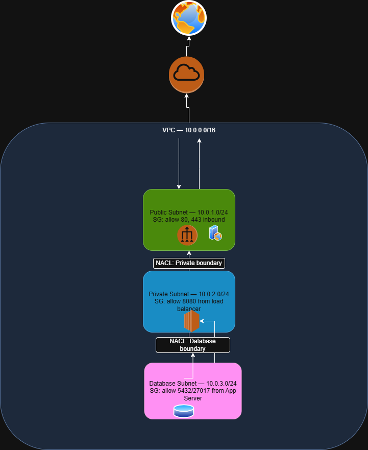

# Week 2 — VPC Architecture & Networking Fundamentals

**AWS Cloud Security Roadmap | Phase 1 — Foundations**

> This is Week 2 of a structured 6-month AWS Cloud Security program.
> For the production-grade evolution of this architecture, see
> [Week 6 — Secure 3-Tier VPC Architecture](https://github.com/Atlas-ghostshell/Secure-3-Tier-VPC-Architecture).

---

## Overview

Week 2 introduced the core networking layer of AWS — the foundation that
everything else in cloud security sits on top of. Before you can harden
an environment, you need to understand how traffic flows through it,
where the boundaries are, and what controls exist at each layer.

This week was deliberately conceptual. The goal was not to build a
production VPC — it was to build an accurate mental model of how VPCs
work before touching the console.

---

## Deliverable

A hand-drawn VPC architecture diagram built in draw.io, mapping a
basic 3-tier network with public and private subnets, CIDR allocation,
routing logic, security groups, and NACLs.

*Initial architecture diagram — freehand, draw.io. Known gaps documented above.*

**Honest note on the diagram:** The NACL placement was conceptually
off — drawn as barriers between subnets rather than wrapped around
them. The NAT Gateway was missing, leaving the private subnet with no
outbound internet path. Availability Zones were not represented.

The core logic — tier separation, CIDR ranges, port rules, SG
directionality — was correct. The gaps were in visual accuracy and
production completeness, both of which were addressed in Week 6.

---

## Concepts Covered

### VPC — Virtual Private Cloud
An isolated virtual network within AWS infrastructure, logically
separated from all other accounts. Scoped to a region, uniquely
identifiable, and fully owned by a single AWS account. Everything
deployed in AWS lives inside a VPC.

### CIDR — Classless Inter-Domain Routing
The system used to allocate IP address ranges within a VPC. The prefix
length (e.g., /16, /24) determines how many bits are fixed vs variable,
which directly controls how many hosts a subnet can support.

Quick reference:
| CIDR | Usable Hosts |
|------|-------------|
| /16  | 65,531      |
| /24  | 251         |
| /28  | 11          |

*AWS reserves 5 IPs per subnet — first 4 and last 1.*

### Routing Tables
The rules that determine where traffic goes inside a VPC. Every subnet
is associated with a route table. The default route (0.0.0.0/0) is
what makes a subnet public (pointing to an IGW) or private (pointing
to a NAT Gateway or nothing). Misconfigured route tables are a
significant attack surface — traffic can be silently redirected.

### Security Groups
Stateful firewall rules attached directly to AWS resources (EC2
instances, RDS, etc.). Return traffic is automatically allowed — only
inbound rules need to explicitly permit the initial connection.
Security groups operate at the resource level and cannot explicitly
deny — they are allow-lists only.

### NACLs — Network Access Control Lists
Stateless firewall rules attached to subnets. Unlike security groups,
NACLs require explicit rules for both inbound AND outbound traffic,
including ephemeral ports (1024–65535) on return traffic. NACLs
support explicit deny, making them useful for blocking specific IPs
or ranges at the subnet boundary.

| Feature | Security Group | NACL |
|---------|---------------|------|
| Scope | Resource | Subnet |
| State | Stateful | Stateless |
| Explicit Deny | No | Yes |
| Rule Evaluation | All rules | Numbered order |

### DNS in AWS
AWS provides a built-in DNS resolver inside every VPC at the base CIDR
address + 2 (e.g., 10.0.0.2 in a 10.0.0.0/16 VPC). This resolver
handles internal hostname resolution and integrates with Route 53 for
custom domains. EnableDnsSupport and EnableDnsHostnames are the two
VPC settings that control DNS behavior.

---

## What Changed by Week 6

| Area | Week 2 | Week 6 |
|------|--------|--------|
| Diagram tool | draw.io (freehand) | draw.io (structured) |
| AZs | Not represented | 2 AZs (us-east-1a/1b) |
| NAT Gateway | Missing | Deployed per AZ |
| NACL placement | Between subnets | Wrapped around subnets |
| Subnets | Public + private | Public, private, DB tier |
| Lab deployed | No | Yes — EC2 in private subnet, NAT verified |

Week 2 was the mental model. Week 6 was the deployment.

---

## Repository
Part of the [AWS Cloud Security Roadmap](https://github.com/Atlas-ghostshell)
